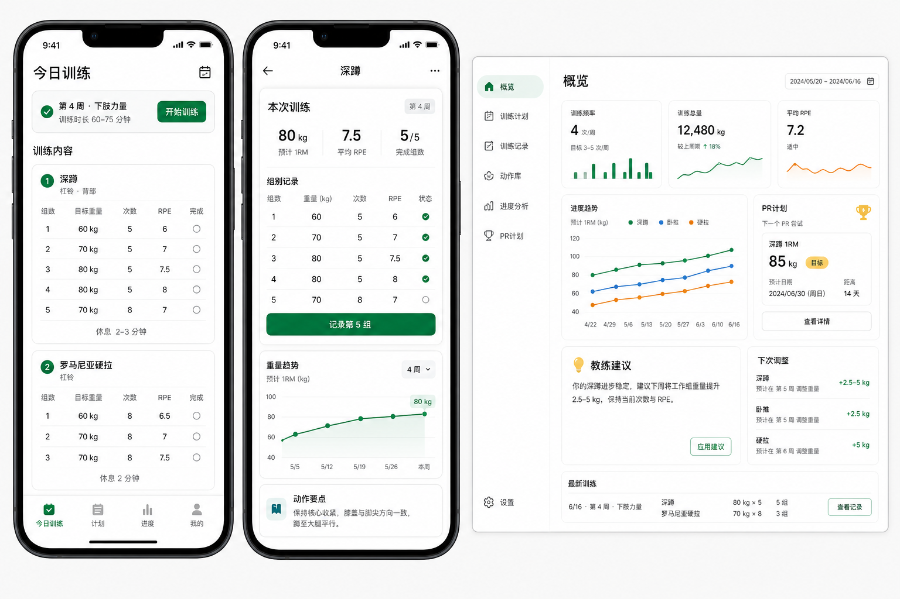

# 力量训练周期管理系统 MVP 产品文档

本目录是一套从 0 到 MVP 的产品实现文档，面向“一个人完成产品、开发、部署和运营”的现实约束。

## 结论先行

建议先做 **移动端优先的响应式 Web/PWA**，而不是原生 App、小程序或纯 PC 版。

- 比 App 简单：不需要应用商店审核、双端开发、推送证书和复杂发布流程。
- 比小程序自由：可控数据模型、可做订阅和网页分享，不被单一平台规则绑定。
- 比 PC 更贴近场景：训练记录发生在健身房手机上，PC 只适合复盘和配置。
- 后续可扩展：PWA 跑通后，可以再封装成 App，或把核心记录流程迁到小程序。

## 文档目录

- [MRD 市场需求文档](docs/01_MRD.md)
- [BRD 商业需求文档](docs/02_BRD.md)
- [PRD 产品需求文档](docs/03_PRD.md)
- [原型图、效果图与流程图](docs/04_prototype_and_flows.md)
- [MVP 实现与运维计划](docs/05_mvp_implementation_plan.md)
- [MVP 可行性评审、资源清单与排期](docs/06_feasibility_resources_schedule.md)
- [你需要准备的资源清单](docs/07_user_resource_checklist.md)
- [产品决策记录](docs/08_decision_log.md)
- [本地开发启动说明](docs/09_development_setup.md)
- [训练计划生成方法论](docs/10_training_methodology.md)
- [MVP 发布验收清单](docs/11_mvp_release_checklist.md)
- [数据库发布与备份手册](docs/12_database_release_runbook.md)
- [Vercel 上线交接清单](docs/13_vercel_deployment_handoff.md)
- [Agent Skill、中文命令与用户隔离](docs/14_agent_skill.md)

## 可分发 Agent Skill

仓库内置用户侧 Skill：[skills/strength-training-manager](skills/strength-training-manager)。安装后，用户可以用中文查看计划、记录训练组和完成训练。每个用户必须在系统设置页生成自己的 Agent 令牌，服务端根据令牌确定用户身份，不接收客户端传入的 `user_id`。

Codex 安装示例：

```bash
python install-skill-from-github.py --repo gitcat7/strength-periodization-manager --path skills/strength-training-manager
```

安装后在 Agent 的安全环境变量中配置 `STRENGTH_MANAGER_TOKEN`，不要把令牌发送到聊天或提交到 Git。

## 效果方向图



## MVP 一句话定义

为健身小白和有一定训练基础的人，提供一份可执行、可记录、会根据完成情况自动微调重量并安排 PR 的力量训练计划。

## 本地验收命令

```bash
pnpm typecheck
pnpm smoke
pnpm release:check
```

`release:check` 会执行类型检查、生产构建、临时启动生产服务并跑冒烟测试。

## MVP 不做什么

- 不做复杂社交社区。
- 不做 AI 聊天教练作为核心卖点。
- 不做动作视频库大而全。
- 不做可穿戴设备接入。
- 不做复杂营养、体脂、睡眠管理。
- 不做健身房 SaaS 管理后台。

先把“训练计划生成、训练记录、重量调整、PR 安排”四件事做扎实。
