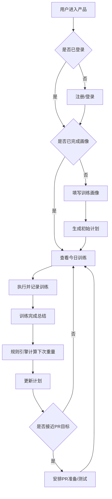

# BRD 商业需求文档

## 1. 商业目标

短期目标：

- 用 6-10 周做出可用 MVP。
- 验证用户是否愿意持续使用动态训练计划。
- 验证“记录后自动调重”和“PR 安排”是否产生足够价值。

中期目标：

- 形成稳定的训练计划引擎和用户训练数据资产。
- 建立付费墙：高级周期模板、更多历史分析、PR 备赛模式、数据导出。
- 通过小规模私域、健身社群、教练合作获取第一批真实用户。

长期目标：

- 成为个人力量训练者的长期训练操作系统。
- 支持教练端管理多个学员，但这不是 MVP 范围。

## 2. 商业价值假设

用户愿意为以下价值付费：

- 少思考：系统告诉我今天练什么、多重、多少组。
- 少踩坑：失败后知道怎么调整。
- 看得到进步：主项 e1RM、训练量、完成率持续可视化。
- 有目标感：系统帮我安排 PR 准备和测试。

## 3. MVP 商业模式

建议 MVP 阶段先做免费内测，不急于接支付。

### 3.1 免费能力

- 创建 1 个当前训练计划。
- 记录训练。
- 查看最近 8 周趋势。
- 自动调整重量。
- 设置 1 个 PR 目标。

### 3.2 未来付费能力

- 多计划并行与历史归档。
- 高级周期模板：531、DUP、Texas Method、Peaking。
- 更长历史数据与高级图表。
- PR 备赛模式。
- 数据导出。
- 自定义规则。
- 教练共享链接。

### 3.3 定价设想

MVP 不上线支付。验证后可考虑：

- 月付：19-29 元。
- 年付：149-199 元。
- 一次性早鸟：99 元买断早期高级版。

## 4. 成本结构

一个人运维时，成本必须低且可控：

- 前端和后端：同一套全栈框架。
- 数据库：托管 PostgreSQL 或 SQLite 起步。
- 鉴权：第三方托管或邮箱魔法链接。
- 部署：Vercel、Cloudflare Pages、Supabase、Railway、Render 中选轻量方案。
- 日志监控：先用平台自带日志，加 Sentry 免费额度。
- 分析：Plausible、PostHog Cloud 免费额度或自建简化事件表。

## 5. 资源约束

项目由一个人完成，因此必须遵守：

- 不做原生双端。
- 不自建复杂运维。
- 不做实时多人协作。
- 不做复杂推荐模型。
- 不做完整动作视频内容生产。
- 不做后台运营系统，先用数据库后台或轻量 Admin 页面。

## 6. 业务范围

### 6.1 MVP 范围

- 用户注册和登录。
- 基础训练画像配置。
- 生成 3 天或 4 天训练计划。
- 今日训练页。
- 训练记录。
- 自动调整重量。
- PR 目标与测试日安排。
- 历史记录和基础趋势图。
- 简单设置和数据导出。

### 6.2 非 MVP 范围

- 社交动态。
- 教练端。
- 食谱和营养。
- 智能穿戴接入。
- 视频动作识别。
- 训练动作教学体系。
- 多语言。
- 企业或健身房管理后台。

## 7. 业务流程

## 8. 关键业务指标

- 注册到完成画像转化率。
- 画像到生成计划转化率。
- 首次训练完成率。
- 每周人均训练记录次数。
- 计划自动推荐被采纳率。
- PR 目标创建率。
- PR 测试完成率。
- 4 周留存。

## 9. 运营策略

### 9.1 冷启动

- 在 2-3 个健身社群招募 20-50 个内测用户。
- 用问卷收集训练经验、当前计划、主要卡点。
- 只开放一个训练目标：基础力量增长。

### 9.2 内容获客

可以发布以下主题内容：

- 为什么新手不该每次都练到力竭。
- 5x5 为什么会卡住，卡住后怎么办。
- 什么时候该冲 PR。
- RPE 不是玄学，怎么用它调整下次重量。
- 用 8 周安排一次深蹲 PR。

### 9.3 用户反馈闭环

- 产品内放“本次建议是否合理”的反馈按钮。
- 每周收集一次活跃用户反馈。
- 重点观察用户手动改重量、跳过训练、失败原因。

## 10. 法务与安全边界

产品必须明确：

- 产品提供训练记录和计划管理，不提供医疗诊断。
- 用户如有伤病、疼痛、特殊健康状况，应咨询专业人士。
- 系统建议不替代线下教练判断。
- PR 测试提示风险，要求充分热身并保留余量。

## 11. BRD 结论

MVP 的商业目标不是立刻赚钱，而是验证“动态训练计划”是否能让用户连续使用 4 周以上。只要能证明用户愿意持续记录并采纳调整建议，再考虑付费功能和更复杂模板。

