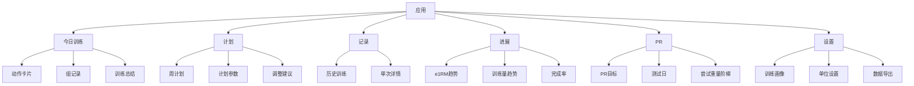
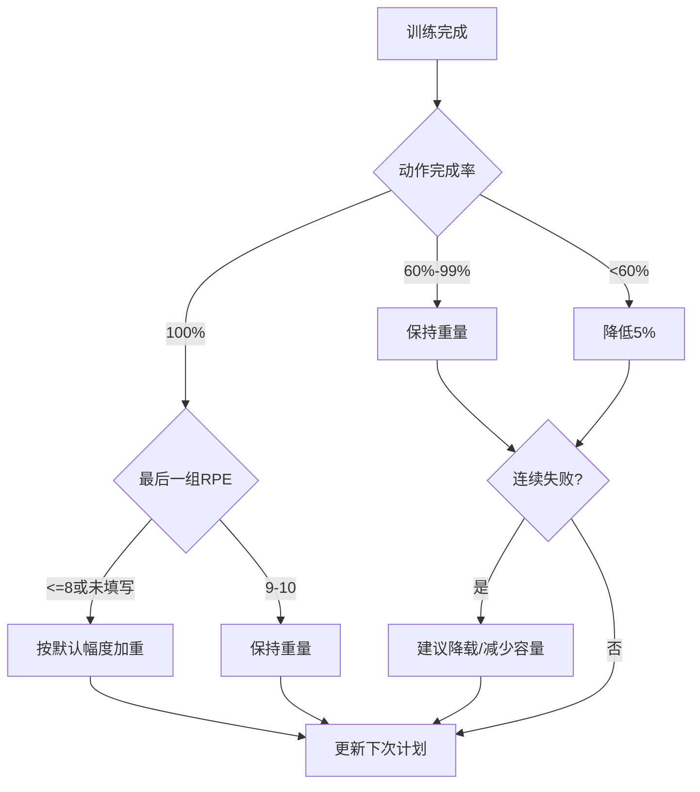

# PRD 产品需求文档

## 1. 文档信息

版本：v0.1  
阶段：MVP  
推荐形态：移动端优先 Web/PWA  
目标用户：健身小白、有一定训练基础的力量训练者  
核心闭环：画像配置 -> 计划生成 -> 今日训练 -> 训练记录 -> 自动调整 -> PR 安排

## 2. 产品目标

MVP 要解决一个核心问题：

用户打开产品后，不需要自己重新设计训练计划，就能知道今天练什么、练多重、做几组；训练完成后，系统能根据表现自动给出下一次建议。

## 3. 用户角色

### 3.1 普通训练者

权限：

- 管理自己的训练画像。
- 创建和执行训练计划。
- 记录训练。
- 查看历史和趋势。
- 创建 PR 目标。

### 3.2 管理者

MVP 阶段管理者就是开发者本人。

权限：

- 查看用户列表和活跃状态。
- 查看错误日志。
- 查看匿名化使用指标。
- 必要时手动修复异常数据。

## 4. 信息架构



## 5. MVP 功能清单

### F001 注册与登录

目标：让用户可以跨设备保存训练数据。

需求：

- 支持邮箱登录。
- 支持游客试用可选，但正式记录需登录。
- 登录后进入今日训练页。

验收标准：

- 用户能完成注册、登录、退出。
- 未登录访问训练页时，引导登录。
- 登录状态刷新页面后保持。

### F002 训练画像配置

目标：收集生成初始计划所需的最小信息。

字段：

- 训练经验：新手、初级、中级。
- 每周训练天数：3 天、4 天。
- 主要目标：力量增长、增肌兼力量。
- 单位：kg、lb。
- 主项当前水平：深蹲、卧推、硬拉、推举，可填 1RM、3RM、5RM 或最近工作组。
- 可训练日：周一至周日多选。
- 单次训练可用时间：45、60、75、90 分钟。
- 伤痛或禁忌动作：MVP 仅记录，不做康复建议。

验收标准：

- 必填项缺失时不能生成计划。
- 用户可以跳过不熟悉的 1RM，用最近训练重量估算。
- 配置完成后自动生成计划。

### F003 计划生成

目标：根据用户画像生成可执行训练计划。

MVP 支持模板：

- 3 天全身线性进阶。
- 4 天上/下肢拆分线性进阶。

计划结构：

- 周期长度：4 周为一个基础块。
- 每周训练：3 或 4 次。
- 每次训练：2-3 个主/辅复合动作 + 1-2 个可选辅助动作。
- 主项默认强度：训练最大值 TM 的 65%-85%。

初始重量计算：

- 如果用户提供 1RM：TM = 1RM * 0.9。
- 如果用户提供 nRM：估算 1RM = 重量 * (1 + 次数 / 30)，TM = 估算 1RM * 0.9。
- 如果用户只提供工作组：用工作组估算 e1RM，再取 90%。
- 新手默认更保守，TM 可再乘 0.95。

验收标准：

- 生成后的计划包含未来 4 周训练。
- 每次训练包含动作、目标组数、目标次数、目标重量。
- 用户可以重新生成计划，但需二次确认。

### F004 今日训练

目标：让用户在健身房快速执行。

页面元素：

- 今日训练标题。
- 预计时长。
- 主项列表。
- 每个动作的目标重量、组数、次数。
- 快速完成按钮。
- 实际重量、次数、RPE 输入。
- 备注输入。
- 完成训练按钮。

交互：

- 默认带出目标重量和次数。
- 用户可以一键标记目标完成。
- 用户可以修改某组重量、次数、RPE。
- 中断训练时自动保存草稿。

验收标准：

- 单手手机操作可完成记录。
- 训练未完成退出后，再次打开能恢复。
- 完成训练后进入总结页。

### F005 训练记录

目标：沉淀结构化训练数据。

记录粒度：

- 单次训练 Session。
- 动作 Exercise Log。
- 组 Set Log。

每组字段：

- 目标重量。
- 实际重量。
- 目标次数。
- 实际次数。
- RPE，MVP 可选。
- 是否完成。

验收标准：

- 用户能查看任意历史训练。
- 历史记录不可误删，删除需二次确认。
- 修改历史记录后，相关趋势和建议重新计算。

### F006 自动重量调整

目标：训练完成后给出下次建议。

MVP 调整规则：

- 目标组全部完成，且最后一组 RPE <= 8：下次上调。
- 目标组全部完成，最后一组 RPE 9-10：下次保持。
- 未完成 1 组：下次保持或微降。
- 未完成 2 组以上：下次降低 5%。
- 同一动作连续 2 次失败：触发降载建议。
- 连续 3-4 周进展良好：提示可安排 PR 或进入下一训练块。

默认加重幅度：

- 上肢主项：+2.5kg。
- 下肢主项：+5kg。
- 辅助动作：+1-2.5kg 或增加次数。

验收标准：

- 每次训练完成后显示“下次建议”。
- 用户可以接受、修改或拒绝建议。
- 系统记录用户是否采纳建议。

### F007 PR 目标与安排

目标：让用户安全、有节奏地测试新纪录。

字段：

- 动作：深蹲、卧推、硬拉、推举。
- 目标重量。
- 目标日期。
- 当前估算 1RM。
- 准备周期：自动计算，MVP 建议 4-8 周。

PR 准备逻辑：

- 距离目标日 > 4 周：正常训练并逐步提升强度。
- 距离目标日 2-3 周：减少容量，提高主项特异性。
- 目标日前 1 周：减量，保留速度和技术。
- 测试日：给出热身和尝试重量阶梯。

测试日尝试阶梯示例：

- 热身：空杆、40%、60%、75%、85%。
- 第一把：当前稳定可完成重量的 95%-98%。
- 第二把：目标 PR。
- 第三把：根据第二把速度建议 +2.5kg 到 +5kg。

验收标准：

- 用户可创建 1 个 MVP PR 目标。
- 系统在计划页展示 PR 倒计时。
- 测试日显示尝试重量建议。

### F008 进展分析

目标：让用户看到训练是否有效。

MVP 图表：

- 各主项 e1RM 趋势。
- 每周训练量。
- 训练完成率。
- 最近 PR。

验收标准：

- 至少有 2 次训练后显示趋势。
- 数据为空时显示空状态。
- 图表在手机上可读。

### F009 数据导出

目标：降低用户迁移顾虑。

需求：

- 支持导出 CSV。
- 导出范围：全部训练记录、动作、组数据。

验收标准：

- 用户可在设置中导出。
- CSV 字段清晰，能被 Excel 打开。

## 6. 关键规则引擎

### 6.1 e1RM 估算

默认公式：

```text
e1RM = weight * (1 + reps / 30)
```

适用条件：

- reps 建议 1-10 次。
- 超过 10 次的组不作为主 e1RM 依据，或降低权重。

### 6.2 完成度判断

```text
目标完成 = 实际次数 >= 目标次数 且 实际重量 >= 目标重量
动作完成率 = 完成组数 / 目标组数
```

### 6.3 下次重量建议



### 6.4 降载规则

触发条件：

- 同一主项连续 2 次完成率 < 80%。
- 用户主观疲劳连续 2 次偏高。
- 训练中断超过 10 天后恢复。

降载方案：

- 重量降低 5%-10%。
- 组数减少 1-2 组。
- 保持动作，不新增复杂变化。

## 7. 页面需求

### 7.1 首页/今日训练

优先级：P0

内容：

- 今日训练名称。
- 当前训练块周数。
- PR 倒计时。
- 动作卡片。
- 完成训练按钮。

空状态：

- 未配置画像：引导配置。
- 今天无训练：显示下一次训练和可选补练入口。

### 7.2 新手引导

优先级：P0

步骤：

1. 选择经验和目标。
2. 选择每周训练天数和可训练日。
3. 填写主项当前水平。
4. 生成计划。

### 7.3 周计划

优先级：P0

内容：

- 当前周所有训练日。
- 每天动作和目标重量。
- 本周重点。
- PR 目标提示。

### 7.4 训练详情

优先级：P0

内容：

- 动作列表。
- 每组输入。
- RPE 可选输入。
- 备注。
- 训练完成总结。

### 7.5 历史记录

优先级：P1

内容：

- 按日期倒序。
- 筛选动作。
- 单次训练详情。

### 7.6 进展页

优先级：P1

内容：

- 主项趋势。
- 周训练量。
- 完成率。

### 7.7 PR 页

优先级：P1

内容：

- 当前 PR 目标。
- 倒计时。
- 准备阶段。
- 测试日尝试阶梯。

### 7.8 设置页

优先级：P1

内容：

- 训练画像。
- 单位。
- 数据导出。
- 注销登录。

## 8. 数据模型

### User

- id
- email
- created_at
- unit

### AthleteProfile

- id
- user_id
- experience_level
- goal
- training_days_per_week
- available_weekdays
- session_duration_minutes
- injury_notes

### Exercise

- id
- name
- category
- default_increment
- is_main_lift

### LiftProfile

- id
- user_id
- exercise_id
- estimated_1rm
- training_max
- source_type
- updated_at

### Program

- id
- user_id
- name
- template_type
- status
- start_date
- end_date

### Workout

- id
- program_id
- user_id
- scheduled_date
- name
- status
- completed_at

### WorkoutExercise

- id
- workout_id
- exercise_id
- order_index
- target_sets
- target_reps
- target_weight

### SetLog

- id
- workout_exercise_id
- set_index
- target_weight
- target_reps
- actual_weight
- actual_reps
- rpe
- completed

### Recommendation

- id
- user_id
- exercise_id
- workout_id
- recommendation_type
- previous_weight
- suggested_weight
- reason
- status

### PrGoal

- id
- user_id
- exercise_id
- current_estimated_1rm
- target_weight
- target_date
- status

## 9. API 草案

### Auth

- `POST /api/auth/login`
- `POST /api/auth/logout`
- `GET /api/me`

### Profile

- `GET /api/profile`
- `PUT /api/profile`

### Program

- `POST /api/programs/generate`
- `GET /api/programs/current`
- `GET /api/workouts/today`
- `GET /api/workouts/:id`

### Workout Log

- `PUT /api/workouts/:id/draft`
- `POST /api/workouts/:id/complete`
- `PUT /api/set-logs/:id`

### Recommendation

- `GET /api/recommendations/latest`
- `POST /api/recommendations/:id/accept`
- `POST /api/recommendations/:id/reject`

### PR

- `GET /api/pr-goals`
- `POST /api/pr-goals`
- `PUT /api/pr-goals/:id`

### Export

- `GET /api/export/training-log.csv`

## 10. 非功能需求

性能：

- 今日训练页首屏加载 < 2 秒。
- 训练记录保存反馈 < 500ms。

可用性：

- 移动端优先，适配 375px 宽度。
- 表单控件足够大，训练中可快速点击。
- 弱网下不丢训练草稿。

安全：

- 用户只能访问自己的数据。
- API 必须校验 user_id。
- 敏感配置不进入前端环境变量。

可靠性：

- 每日自动数据库备份。
- 错误日志可追踪。
- 关键操作保留 created_at 和 updated_at。

## 11. 埋点

核心事件：

- `signup_completed`
- `profile_completed`
- `program_generated`
- `workout_started`
- `set_logged`
- `workout_completed`
- `recommendation_accepted`
- `recommendation_modified`
- `pr_goal_created`
- `csv_exported`

## 12. MVP 验收标准

MVP 完成的标准：

- 新用户可以从注册到生成计划。
- 用户可以完成至少 4 周训练记录。
- 系统能根据完成情况调整下次重量。
- 用户可以创建 PR 目标并看到测试建议。
- 用户可以查看历史和基础趋势。
- 系统可稳定部署，开发者一个人能维护。

