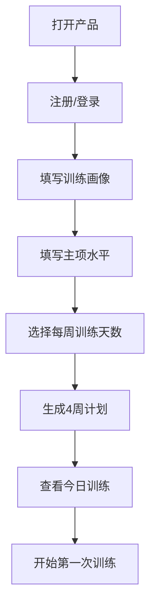
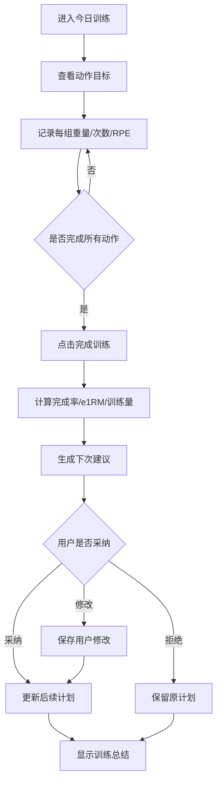
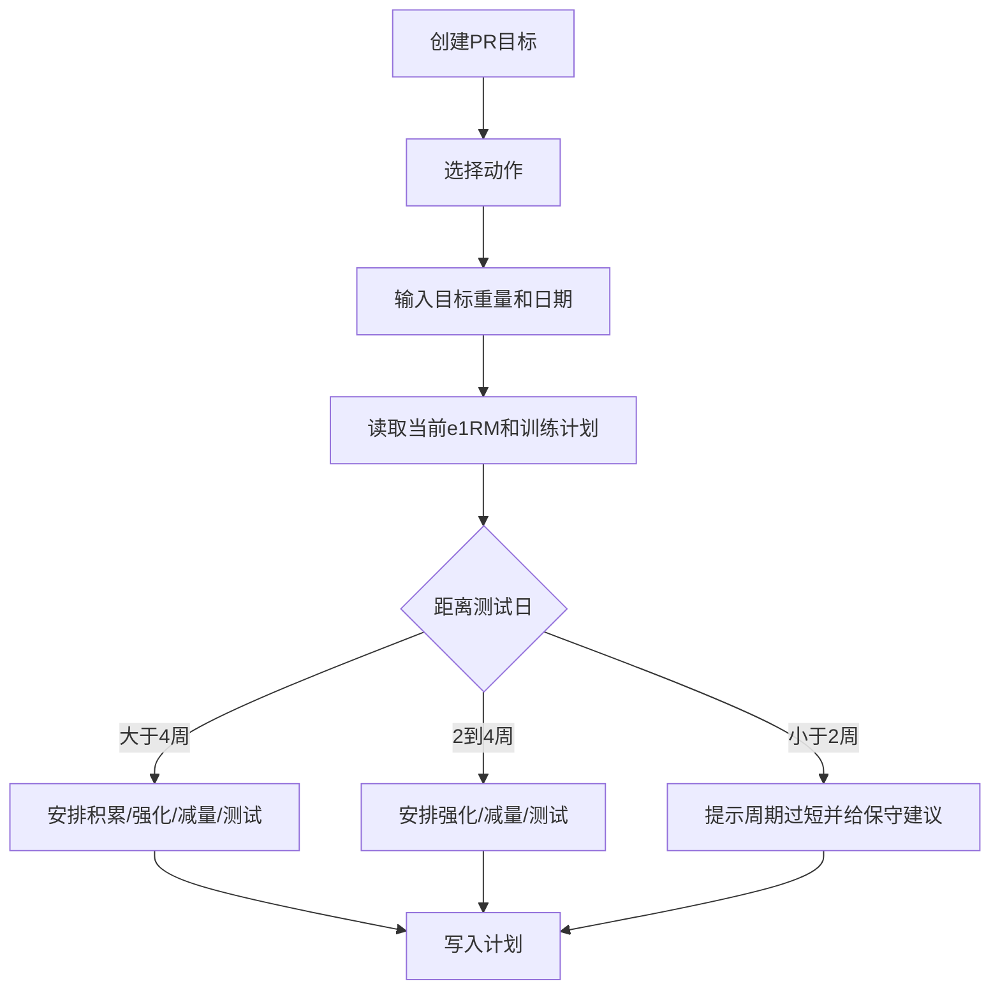
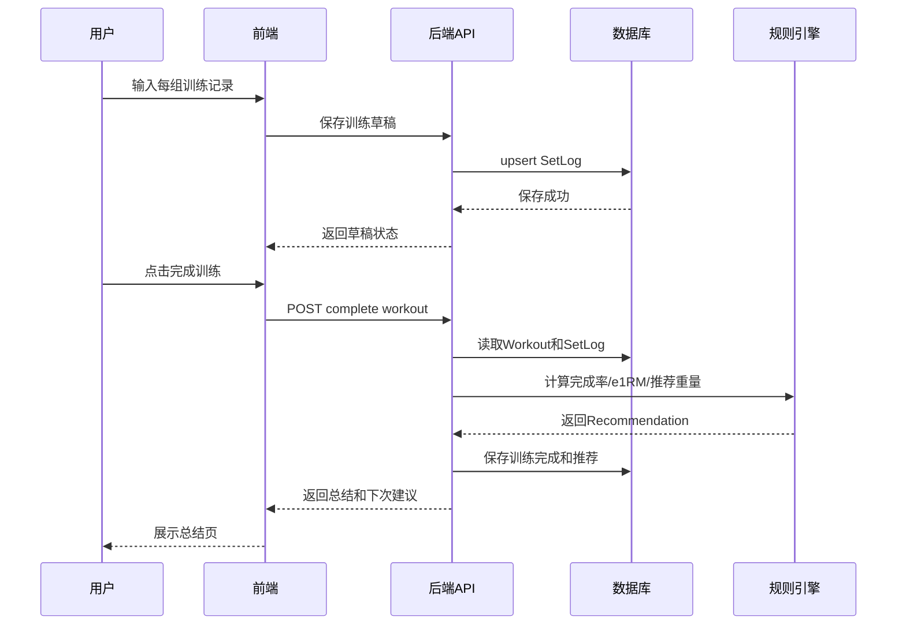

# 原型图、效果图与流程图

## 1. 效果方向图

下图是移动端优先的产品视觉方向：重点是今日训练、重量建议、PR 安排和趋势复盘。


生成方式：使用内置 imagegen 工具生成 UI mockup，并复制到项目 `assets/mvp-ui-concept.png`。

## 2. 主要导航

MVP 推荐底部 5 个 Tab：

- 今日
- 计划
- 记录
- 进展
- PR

设置入口放在右上角或“我的”轻入口，不单独占底部 Tab。

## 3. 移动端低保真原型

### 3.1 今日训练

```text
┌─────────────────────────┐
│ 今日训练        设置 ⚙   │
│ 第2周 / 第1练    PR 24天 │
├─────────────────────────┤
│ 深蹲                    │
│ 目标 5组 x 5次 @ 80kg   │
│ ┌────┬─────┬────┬─────┐ │
│ │组  │重量 │次数│ RPE │ │
│ ├────┼─────┼────┼─────┤ │
│ │1   │80   │5   │ 7   │ │
│ │2   │80   │5   │ 7.5 │ │
│ │3   │80   │5   │ 8   │ │
│ │4   │80   │5   │     │ │
│ │5   │80   │5   │     │ │
│ └────┴─────┴────┴─────┘ │
│ [全部完成] [添加一组]    │
├─────────────────────────┤
│ 卧推                    │
│ 目标 5组 x 5次 @ 55kg   │
│ [开始记录]              │
├─────────────────────────┤
│ 划船                    │
│ 目标 3组 x 8次 @ 50kg   │
│ [开始记录]              │
├─────────────────────────┤
│ [完成本次训练]          │
└─────────────────────────┘
```

### 3.2 训练完成总结

```text
┌─────────────────────────┐
│ 本次训练完成             │
├─────────────────────────┤
│ 完成率 92%               │
│ 训练量 6,420 kg          │
│ 预计用时 68 min          │
├─────────────────────────┤
│ 下次建议                 │
│ 深蹲 80kg -> 85kg        │
│ 原因：全部完成，RPE <= 8 │
│ [采纳] [修改]            │
│                         │
│ 卧推 55kg -> 55kg        │
│ 原因：最后一组 RPE 9     │
│ [采纳] [修改]            │
├─────────────────────────┤
│ [查看周计划] [返回今日]  │
└─────────────────────────┘
```

### 3.3 新手引导

```text
┌─────────────────────────┐
│ 创建你的力量训练计划      │
├─────────────────────────┤
│ 训练经验                 │
│ ○ 新手  ● 初级  ○ 中级   │
│                         │
│ 每周训练                 │
│ ○ 3天   ● 4天            │
│                         │
│ 主要目标                 │
│ ● 力量增长               │
│ ○ 增肌兼力量             │
│                         │
│ 主项当前水平             │
│ 深蹲  80kg x 5           │
│ 卧推  55kg x 5           │
│ 硬拉  100kg x 5          │
│ 推举  35kg x 5           │
│                         │
│ [生成计划]               │
└─────────────────────────┘
```

### 3.4 PR 页面

```text
┌─────────────────────────┐
│ PR计划                   │
├─────────────────────────┤
│ 深蹲目标：120kg          │
│ 测试日：2026-09-01       │
│ 倒计时：42天             │
│ 当前阶段：积累期          │
├─────────────────────────┤
│ 接下来3周                │
│ W1 5x5 @ 80%             │
│ W2 4x4 @ 82.5%           │
│ W3 5x3 @ 85%             │
├─────────────────────────┤
│ 测试日尝试               │
│ 第一把 112.5kg           │
│ 第二把 120kg             │
│ 第三把 根据速度调整       │
│ [编辑目标]               │
└─────────────────────────┘
```

## 4. 核心用户流程

### 4.1 首次使用流程



### 4.2 训练记录流程



### 4.3 PR 安排流程



## 5. 训练完成时序图



## 6. 后台管理原型

MVP 不建议做完整后台，先做一个仅开发者可访问的简化页面。

```text
┌─────────────────────────────────────┐
│ Admin                               │
├─────────────────────────────────────┤
│ 活跃用户  本周训练数  错误数          │
│ 42        128       3               │
├─────────────────────────────────────┤
│ 最近用户                              │
│ email        训练次数   最后活跃       │
│ a@x.com      8        2026-07-01     │
│ b@x.com      3        2026-06-30     │
├─────────────────────────────────────┤
│ 最近错误                              │
│ time        route       message       │
└─────────────────────────────────────┘
```

## 7. 设计原则

- 训练现场优先：少字、少层级、大按钮。
- 默认值优先：用户只在异常时修改。
- 建议可解释：每个重量调整都要说明原因。
- 新手少术语：可以显示“强度偏高”，不要一上来堆 RPE/TM/e1RM。
- 进阶不封死：允许用户编辑计划和建议。

