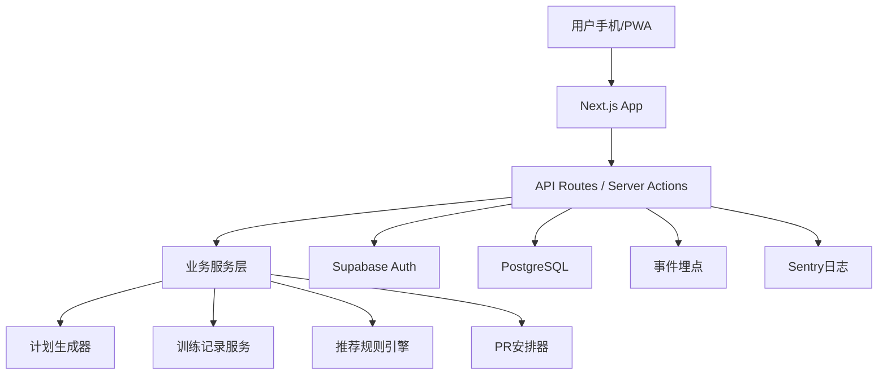

# MVP 实现与运维计划

## 1. 技术形态选择

推荐：移动端优先响应式 Web/PWA。

不优先选择原生 App：

- 一个人开发双端成本高。
- 发布审核和版本管理成本高。
- MVP 阶段验证速度慢。

不优先选择小程序：

- 平台限制更多。
- 后续会员、数据导出、网页分享不如 Web 自由。
- 仍需要后端和管理体系。

不优先选择纯 PC：

- 训练记录主要发生在健身房手机场景。
- PC 可作为响应式大屏复盘，不应作为第一入口。

## 2. 推荐技术栈

### 2.1 最省心方案

- 框架：Next.js
- 语言：TypeScript
- UI：Tailwind CSS + shadcn/ui
- 数据库：Supabase PostgreSQL
- 鉴权：Supabase Auth
- 图表：Recharts
- 表单：React Hook Form + Zod
- 部署：Vercel
- 日志：Sentry
- 埋点：PostHog 或自建 events 表

优点：

- 前后端一体。
- 部署简单。
- Supabase 自带鉴权、数据库、备份能力。
- 后续转 App 或小程序仍可复用 API 和规则引擎。

### 2.2 更低成本本地优先方案

- 框架：Next.js
- 数据库：SQLite + Prisma
- 部署：单 VPS + Docker

优点是成本低，缺点是备份、运维和扩容都要自己做。作为一个人长期维护，不如托管 PostgreSQL 省心。

## 3. 系统架构



## 4. 代码模块建议

```text
src/
  app/
    today/
    onboarding/
    plan/
    history/
    progress/
    pr/
    settings/
    admin/
  components/
    workout/
    plan/
    charts/
    forms/
  domain/
    exercises.ts
    estimate-1rm.ts
    progression.ts
    program-generator.ts
    pr-planner.ts
  server/
    auth.ts
    db.ts
    workout-service.ts
    program-service.ts
    recommendation-service.ts
  lib/
    analytics.ts
    units.ts
```

## 5. 开发里程碑

### Milestone 1：项目骨架和数据模型，约 3-5 天

交付：

- Next.js 项目。
- 数据库 schema。
- 登录注册。
- 基础布局和移动端导航。

验收：

- 用户能登录。
- 数据库能保存用户。
- 移动端页面框架可访问。

### Milestone 2：画像配置和计划生成，约 5-7 天

交付：

- Onboarding 表单。
- 主项水平输入。
- 3 天和 4 天模板生成。
- 周计划页面。

验收：

- 新用户可生成 4 周训练计划。
- 计划包含动作、重量、组数、次数。

### Milestone 3：今日训练和记录，约 7-10 天

交付：

- 今日训练页。
- 动作卡片。
- 组记录输入。
- 草稿保存。
- 完成训练。

验收：

- 用户可完整记录一次训练。
- 刷新页面不丢草稿。
- 训练完成后生成记录。

### Milestone 4：自动调重和总结，约 5-7 天

交付：

- e1RM 计算。
- 完成率计算。
- 下次重量建议。
- 采纳/修改/拒绝建议。

验收：

- 系统根据表现给出建议。
- 采纳后更新后续计划。
- 建议有可解释原因。

### Milestone 5：PR 和进展，约 5-7 天

交付：

- PR 目标创建。
- PR 准备阶段。
- 测试日尝试阶梯。
- e1RM 和训练量趋势图。

验收：

- 用户可设置一个 PR 目标。
- 进展页显示基础趋势。

### Milestone 6：内测发布，约 3-5 天

交付：

- 部署到线上。
- 基础 Admin 页面。
- Sentry 错误监控。
- 数据导出。
- 免责声明。

验收：

- 真实用户可注册使用。
- 你能查看错误和关键指标。
- 数据有备份策略。

## 6. 数据库表优先级

P0：

- users
- athlete_profiles
- exercises
- lift_profiles
- programs
- workouts
- workout_exercises
- set_logs
- recommendations

P1：

- pr_goals
- analytics_events
- admin_notes

P2：

- billing_subscriptions
- shared_coach_links
- custom_templates

## 7. 最小训练模板

### 7.1 3 天全身线性进阶

Day A：

- 深蹲 5x5
- 卧推 5x5
- 划船 3x8
- 可选核心 3x10

Day B：

- 硬拉 3x5
- 推举 5x5
- 引体向上或下拉 3x8
- 腿弯举 3x10

Day C：

- 深蹲轻量 3x5
- 卧推变式或推举 4x6
- 罗马尼亚硬拉 3x8
- 划船 3x8

### 7.2 4 天上/下肢拆分

Lower 1：

- 深蹲 5x5
- 罗马尼亚硬拉 3x8
- 弓步或腿举 3x10

Upper 1：

- 卧推 5x5
- 划船 4x8
- 推举 3x6
- 引体或下拉 3x8

Lower 2：

- 硬拉 3x5
- 前蹲或轻深蹲 3x6
- 腿弯举 3x10

Upper 2：

- 推举 5x5
- 卧推轻量 3x8
- 划船 3x8
- 二头/三头可选 2-3 组

## 8. 计划生成伪代码

```ts
function generateProgram(profile, liftProfiles) {
  const template = chooseTemplate(profile.trainingDaysPerWeek);
  const trainingMaxes = calculateTrainingMaxes(liftProfiles, profile.experienceLevel);

  return template.weeks.map((week, weekIndex) => {
    return week.workouts.map((workout) => {
      return {
        scheduledDate: pickDate(profile.availableWeekdays, weekIndex, workout.dayIndex),
        exercises: workout.exercises.map((item) => {
          const tm = trainingMaxes[item.exerciseId];
          return {
            exerciseId: item.exerciseId,
            targetSets: item.sets,
            targetReps: item.reps,
            targetWeight: roundToPlate(tm * item.intensity),
          };
        }),
      };
    });
  });
}
```

## 9. 调重伪代码

```ts
function recommendNextWeight(result) {
  if (result.completionRate === 1 && (result.lastSetRpe == null || result.lastSetRpe <= 8)) {
    return increase(result.currentWeight, result.exercise.defaultIncrement);
  }

  if (result.completionRate === 1 && result.lastSetRpe >= 9) {
    return result.currentWeight;
  }

  if (result.completionRate >= 0.6) {
    return result.currentWeight;
  }

  return roundToPlate(result.currentWeight * 0.95);
}
```

## 10. 运维策略

### 10.1 部署

推荐：

- Vercel 部署前端和 API。
- Supabase 托管数据库和 Auth。
- 环境变量只放在平台后台。

### 10.2 备份

- Supabase 开启自动备份。
- 每周导出一次数据库快照。
- 训练记录导出功能既服务用户，也方便紧急迁移。

### 10.3 监控

必须监控：

- API 错误率。
- 登录失败。
- 训练完成接口失败。
- 推荐规则异常。
- 页面加载错误。

### 10.4 灰度发布

一个人开发时建议：

- 先只给 5 个熟人用户。
- 再扩大到 20-50 人。
- 不做自动大规模拉新，避免支持压力爆炸。

## 11. 安全与免责声明

页面底部或设置页放置：

```text
本产品用于训练记录和计划管理，不构成医疗、康复或个性化诊断建议。
如果你有伤病、疼痛或特殊健康状况，请咨询医生、物理治疗师或专业教练。
进行大重量和 PR 测试前，请充分热身并保留安全余量。
```

## 12. MVP 发布清单

- 登录注册可用。
- 首次引导完整。
- 3 天和 4 天计划可生成。
- 今日训练可记录。
- 草稿不会丢。
- 完成训练后有总结。
- 下次重量建议可采纳。
- PR 目标可创建。
- 趋势图可查看。
- CSV 可导出。
- 线上数据库有备份。
- 错误监控可用。
- 免责声明可见。

## 13. 后续路线

v0.2：

- 更多训练模板。
- 自定义动作。
- 更细的疲劳管理。
- 周期结束复盘。

v0.3：

- 付费会员。
- 高级图表。
- 教练分享链接。
- 更强的 PR 备赛模式。

v1.0：

- 完整模板市场。
- 教练端。
- App 封装或小程序版本。

