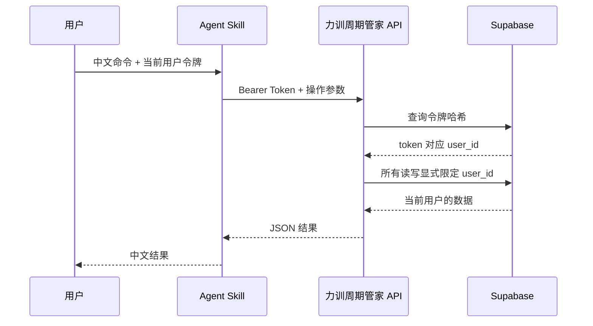

# Agent Skill、中文命令与用户隔离

## 目标

让支持安装文件型 Skill 且能运行 Python 3 的 Agent，通过中文命令操作力训周期管家。Skill 位于：

```text
skills/strength-training-manager
```

Skill 不包含用户数据、登录密码、Supabase 管理密钥或应用源代码副本。它通过线上 `/api/agent/v1` 调用系统。

## 用户隔离



安全规则：

- 原始令牌只在创建时显示一次，数据库仅保存 SHA-256 哈希。
- Agent 请求不能提交 `user_id`；服务端只信任令牌解析出的用户。
- 涉及子表写入时，服务端先验证 workout 所有权。
- 令牌默认 180 天到期，可在设置页随时撤销。
- `SUPABASE_SERVICE_ROLE_KEY` 只保存在 Vercel 服务端环境变量中。

## 上线步骤

1. 备份 Supabase 数据库。
2. 在 Supabase SQL Editor 执行 `supabase/migrations/20260711_agent_access_tokens.sql`。
3. 在 Vercel 为 Production、Preview、Development 添加 `SUPABASE_SERVICE_ROLE_KEY`。
4. 重新部署项目。
5. 登录系统，进入“设置”，生成 Agent 令牌。
6. 将令牌配置到 Agent 的安全环境变量 `STRENGTH_MANAGER_TOKEN`。
7. 安装仓库中的 `skills/strength-training-manager`。
8. 先执行只读命令“查看今天训练”，再测试一条写入命令。

## 中文操作范围

- 查看今天或下一次训练。
- 查看当前周期计划。
- 查看最近训练历史。
- 查看训练量、完成组数和平均 RPE。
- 查看 PR 目标。
- 按动作记录 ID 写入实际重量、次数和 RPE。
- 完成指定训练。

第一版不允许 Agent 创建用户、删除训练数据、修改训练画像、生成新周期或代替用户决定训练重量。这些高影响能力需要单独设计确认流程后再开放。

## 兼容性边界

该目录遵循 `SKILL.md + scripts + references + agents` 的文件型 Skill 结构。支持这种结构并允许执行 Python 3/HTTPS 请求的 Agent 可以复用。不同厂商若使用私有插件格式，需要写一个很薄的适配清单，但用户隔离 API 和命令脚本无需重写。
